<div align="center">




</div>

---

## 👨‍💻 About Me

🔐 Cybersecurity researcher working across **Offensive Security, Red Teaming, Blue Teaming/SOC, and Cloud Security**

🎓 B.E. Computer Science Engineering, **University Institute of Technology, University of Burdwan** (CGPA 7.7)

🐛 Freelance bug bounty researcher on **HackerOne, Bugcrowd and Yogosha** — BOLA, IDOR, auth bypass, injection & cloud misconfigs

🛡️ Former **Cyber Security / Red Team Intern** at Vaishnav Technologies — adversary simulation, network enumeration, exploitation

🏆 Top 1% TryHackMe · HTB Global Rank 912 · 4th place, Infocom Hacksters CTF

🎯 Cyber Security Tech Lead & Vice President — **The CodeBird, UIT Burdwan**

---

## 🚀 Featured Cybersecurity Projects

### 🛡 AI-Driven DDoS Defense
🔗 https://github.com/Himangshu30/AI-Driven-DDoS-Defense-Smarter-Network-Protection

- ML-based anomaly detection
- Real-time network traffic monitoring
- AWS-based mitigation architecture

---

### 🎣 Phishing Detection Pipeline
🔗 https://github.com/Himangshu30/phishing-detection-pipeline

- Full ML pipeline for phishing URL detection using TF-IDF and Random Forest
- Threat intel API integration for enrichment

---

### 🍯 JWT Honeypot System
🔗 https://github.com/Himangshu30/jwt-honeypot-system

- Detect malicious token usage
- Track attacker behavior
- API security research

---

### 🔗 Supply Chain Attack Simulation & Hardening
🔗 https://github.com/Himangshu30/supply-chain-attack-simulation-amd-hardening

- Simulated dependency confusion and malicious package injection in CI/CD pipelines
- Implemented dependency pinning and integrity verification

---

### 🕵️ Recon & Exploit Framework
🔗 https://github.com/Himangshu30/Recon-Exploit-Framework

- Automated OSINT collection, subdomain enumeration and vulnerability discovery
- Combines port scanning and exploitation modules for red team operations

---

### 🔥 Reverse Shell Backdoor Framework
🔗 https://github.com/Himangshu30/BackDoor-Framework-for-Reverse-Shell

- Modular reverse shell framework (Python)
- File exfiltration, privilege escalation, keylogging, persistence modules

---

### 🌐 Docker Based Network Traffic Analyzer

Architecture

```
Attacker → Victim → Zeek → Splunk → Detection Dashboard
```

- Containerized SOC lab
- Network threat monitoring
- Traffic analysis pipeline

---

## 🧠 Cybersecurity Skills

- Offensive Security: Penetration Testing, Exploitation, Post-Exploitation, Lateral Movement, Persistence
- Red Teaming: Active Directory Attacks, Adversary Simulation, Social Engineering, Evasion Techniques
- Blue Teaming: Threat Hunting, Log Analysis, SIEM Management, Incident Response, Threat Intelligence
- Cloud Security: AWS IAM, S3 Security, GuardDuty, Security Automation
- Reconnaissance: OSINT, Subdomain Enumeration, Network Mapping, Vulnerability Scanning
- Application Security: Bug Bounty Hunting, API Security Testing (BOLA/IDOR), Web Exploitation

---

## 💻 Programming Languages

<p>


</p>

---

## 🔐 Application Security Tools

<p>


</p>

Tools

- Burp Suite
- Metasploit
- Cobalt Strike
- BloodHound
- Mimikatz
- Empire
- SQLMap
- Impacket

---

## 🌐 Network Security Tools

<p>


</p>

Tools

- Nmap
- Wireshark
- Suricata
- Wazuh

---

## ☁️ Cloud Security

<p>


</p>

Services

- AWS IAM
- AWS S3 Security
- AWS GuardDuty
- GCP
- CloudFormation

---

## 🛡 SOC / Detection Tools

<p>


</p>

Tools

- Splunk
- ELK Stack
- Nessus
- Threat Hunting
- Incident Response

---

## 🐳 DevOps & Infrastructure

<p>


</p>

---

## 🏆 Achievements

- 🥇 4th Place — Infocom Hacksters CTF (100+ teams)
- 🎯 Top 1% — TryHackMe
- 🚩 Hack The Box — Global Rank 912
- 📝 Publication — West Bengal Science Congress
- 🧑‍💻 Participated in 20+ CTFs, 10 Hackathons, multiple tech conferences
- 🛡️ Cyber Security Tech Lead & Vice President — The CodeBird, UIT Burdwan

---

## 📊 GitHub Stats

<p align="center">

</p>

<p align="center">

</p>

---

## 📈 Contribution Graph

<p align="center">

</p>

---

## 📫 Connect With Me

<p>

<a href="https://github.com/Himangshu30">

</a>

<a href="https://linkedin.com/in/himangshu-sarkar-b4ba3a22a">

</a>

<a href="https://medium.com/@himangshusarkar622">

</a>

<a href="https://himangshusarkar.vercel.app">

</a>

<a href="mailto:himangshusarkar622@gmail.com">

</a>

</p>

---

⭐ If you like my work, consider **starring my repositories**
